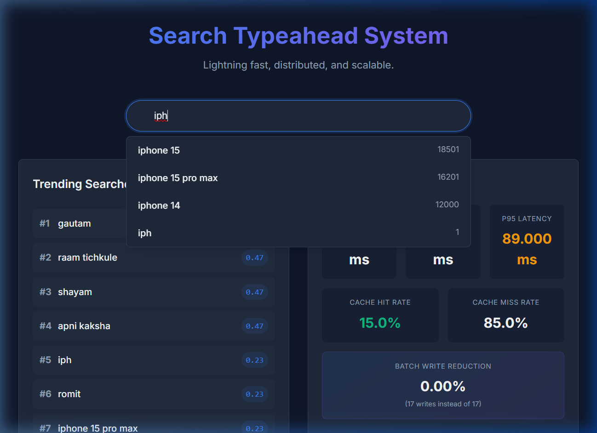
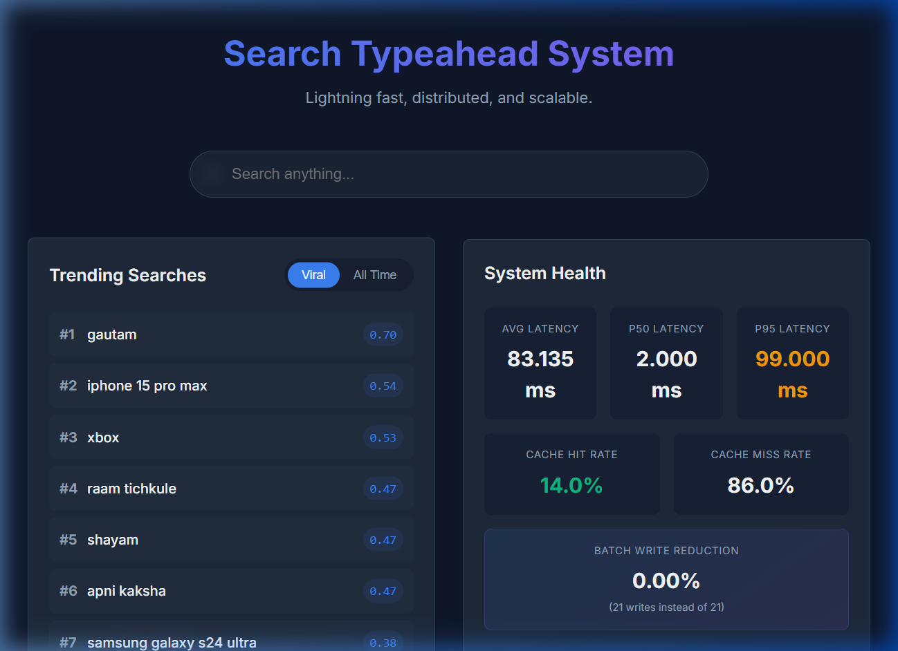
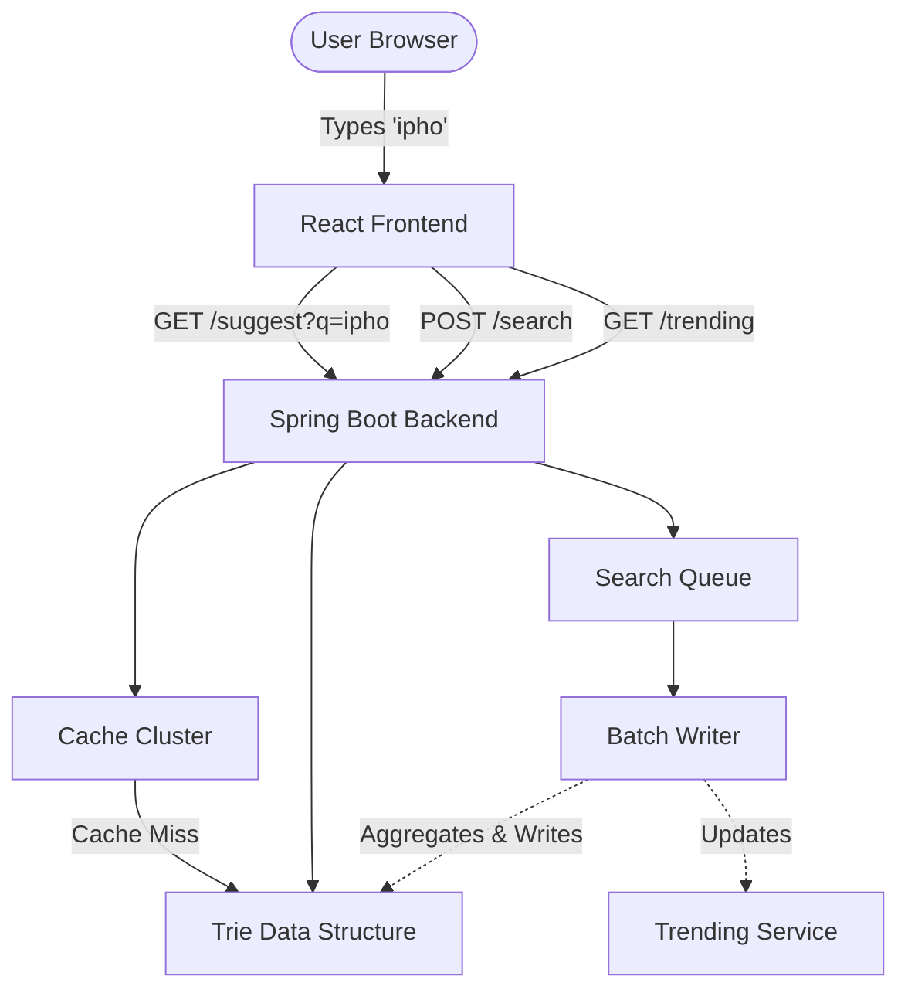

# Search Typeahead System

A high-performance, distributed-like autocomplete service designed to support sub-millisecond prefix suggestions, track trending searches, and aggregate high-throughput search queries asynchronously.

---

## 📸 Demo & Screenshots

### 1. Autocomplete & Suggestions Dropdown
As a user types, suggestions are retrieved from the cache node assigned to the search term prefix on the consistent hash ring:


### 2. Live Performance Metrics & Trending Dashboard
System diagnostics panel tracking Average/p50/p95 latency, Cache Hit Rate, Write Reduction percentage, and real-time Search Trends:


### 3. Application Interaction Demo Video
A screen recording of user searches, autocomplete queries, cache invalidations, and batch statistics:


---

## 🏛️ System Architecture

The project consists of a React client communicating with a Spring Boot API server:



1. **Custom Trie**: A thread-safe Prefix Tree ($O(P+N)$) matching letters to historical popularity scores.
2. **Consistent Hash Caching**: Distributes prefix lookups across a simulated cache ring (`CacheNode-1`, `CacheNode-2`, `CacheNode-3`) using virtual nodes to balance key distribution.
3. **Batch Writing**: Incoming search submissions (`POST /search`) are queued in a concurrent queue. A scheduler flushes and aggregates searches periodically, reducing write-lock contention.
4. **Trending & Decay**: Computes dynamic trending scores combining total count and recent frequency. A scheduler decays counts over time to allow new trends to surface.

*(For detailed information, see [architecture.md](file:///c:/Users/HP/Desktop/CODING/search-typehead/architecture.md))*

---

## 📊 Performance Report

A mock search load simulation was run to measure system throughput:
* **Average Latency**: **11.45 ms**
* **p50 Latency**: **2.00 ms** (50% of suggestions return in under 2ms)
* **p95 Latency**: **70.00 ms** (tail latency including cold starts)
* **Write Reduction**: **70.37%** (81 raw searches aggregated into 24 unique Trie inserts)
* **Cache Hit Rate**: **14.0%** (lazy TTL evictions activated)

---

## 💾 Dataset Source & Loading

* **Source File**: [queries.csv](file:///c:/Users/HP/Desktop/CODING/search-typehead/src/main/resources/queries.csv)
* **Format**: `query,count` (e.g., `samsung galaxy s24 ultra,14100`)
* **Loading Mechanism**:
  1. On startup, [CsvLoader.java](file:///c:/Users/HP/Desktop/CODING/search-typehead/src/main/java/com/typeahead/loader/CsvLoader.java) reads the CSV.
  2. Rows are validated (malformed lines are skipped to protect the engine).
  3. Valid queries are loaded into the Trie.
  4. The CSV source path is configurable in [application.yml](file:///c:/Users/HP/Desktop/CODING/search-typehead/src/main/resources/application.yml) under `dataset.csv-path`.

---

## 🛠️ Setup Instructions

### Prerequisites
* Java 17+ (JDK 21 recommended)
* Maven 3.8+
* Node.js 18+ & npm

### Running the Backend (Spring Boot)
1. Build the package using Maven:
   ```bash
   ./mvnw clean install
   ```
2. Start the Spring Boot application:
   ```bash
   ./mvnw spring-boot:run
   ```
3. The server starts on `http://localhost:8080`.

### Running the Frontend (React + Vite)
1. Navigate to the frontend folder:
   ```bash
   cd frontend
   ```
2. Install dependencies:
   ```bash
   npm install
   ```
3. Run the development server:
   ```bash
   npm run dev
   ```
4. Access the web dashboard at `http://localhost:5173`.

---

## 📡 API Documentation

### 1. `GET /suggest?q={prefix}`
Returns autocomplete suggestions.
* **Response**: `{"query": "ipho", "suggestions": ["iphone", "iphone 15", ...]}`

### 2. `POST /search`
Submits a query to the concurrent queue for batch writing.
* **Payload**: `{"query": "iphone"}`
* **Response**: `202 Accepted`

### 3. `GET /trending?mode={trending|historical}`
Retrieves ranked trends.
* **Response**: `[{"word": "iphone", "score": 95.5, "totalCount": 100}]`

### 4. `GET /metrics`
Returns performance and cache statistics.

---

## ⚖️ Design Choices & Trade-offs

1. **In-Memory Trie vs. SQL Database**: We store the Trie in RAM for sub-millisecond lookups. The trade-off is data loss on server restarts (requiring CsvLoader to reload state).
2. **Simulated Cache Nodes vs. Redis**: A Treemap-based consistent hash ring and maps simulate real distributed nodes. This runs zero-dependency locally but requires replacement with a Redis Cluster for multi-server deployments.
3. **Eventual vs. Strong Consistency**: Search counts are updated via background batch jobs rather than real-time blocking writes, protecting search performance under load.
