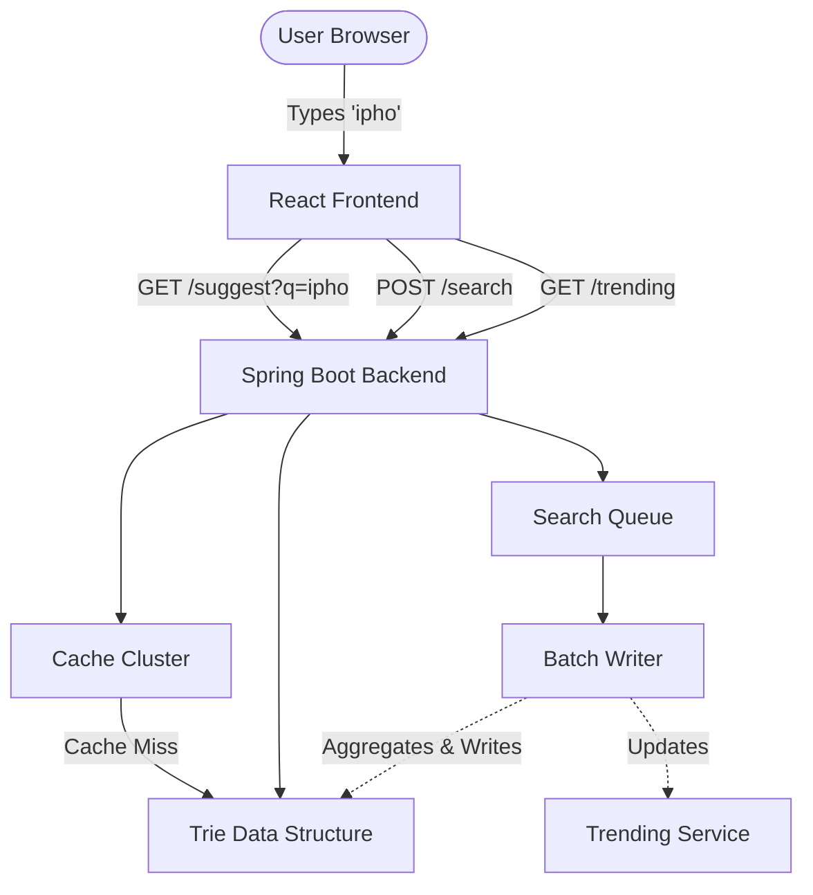
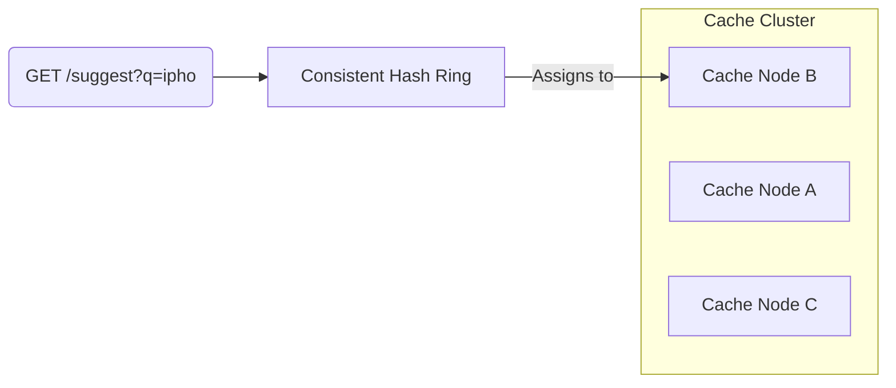
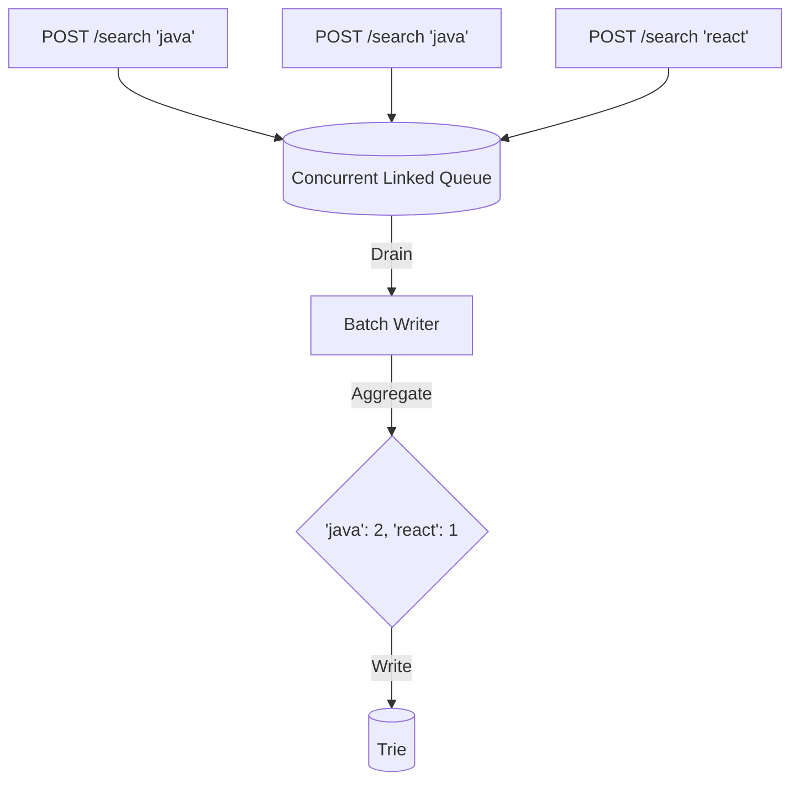

# Search Typeahead Architecture

This document outlines the architecture of the Search Typeahead System, detailing how the components interact from the client down to the data structures.

## High Level Architecture Diagram

## 1. The Trie Data Structure
The core of the suggestion engine is a Custom Trie (Prefix Tree).
- Why Trie?: Allows for O(L) insertion and O(P + N) prefix searches (where L is word length, P is prefix length, and N is the number of matching descendant nodes).
- How it works: Each node represents a character. Navigating down the tree forms a query. Nodes marked as `isEndOfWord` store the historical popularity count. The search traverses to the end of the prefix, then performs a Depth-First Search (DFS) to collect and sort all child words by popularity.

## 2. Cache Cluster & Consistent Hashing
To reduce latency and alleviate load on the Trie during traffic spikes, we employ an in-memory distributed-like Cache Cluster.
- Why Consistent Hashing?: Requests are routed to cache nodes based on the hash of the prefix. Consistent hashing minimizes key redistribution when cache nodes are added or removed, ensuring high cache hit rates during scaling operations.
- Cache Hit: Returns suggestions immediately from the assigned `CacheNode` (O(1)).
- Cache Miss: Queries the Trie, then populates the cache with a Time-To-Live (TTL).

## 3. Batch Writes
Handling a high volume of writes synchronously can lock the Trie and degrade read performance. We use a batch writing strategy.
- SearchQueue: Incoming `POST /search` requests are immediately added to a concurrent queue and an "Accepted" response is returned ($O(1)$ latency for the user).
- BatchWriter: A scheduled background job runs periodically (e.g. every 5 seconds) or when the queue hits a threshold (e.g. 100 items).
- Aggregation: It aggregates duplicates (e.g., 3 separate searches for "iphone" become a single Trie insert of `count=3`), dramatically reducing the lock contention on the Trie.

## 4. Trending Searches
To surface both all-time popular queries and sudden viral searches, we maintain dual ranking modes.
- Historical Mode: Ranks purely by the all-time `totalCount`.
- Trending Mode: Uses a composite score: `0.7  normalized(totalCount) + 0.3  normalized(recentCount)`.
- Decay Mechanism: A scheduled job halves the `recentCount` every minute. This ensures that old spikes fade away, preventing permanent boosting and allowing genuinely new trends to surface.
